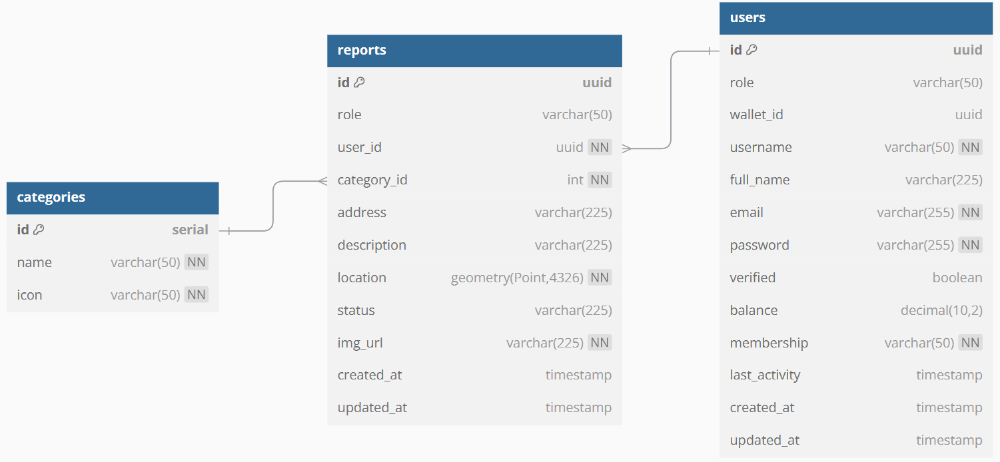
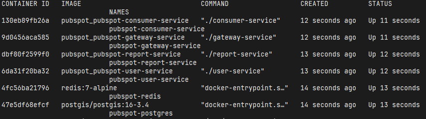

# PubSpot

> A digital platform that enables users to report and share public issues using photos and geolocation data. Built with a microservices architecture using Go Fiber framework, gRPC for inter-service communication, and Redis for background processing. The entire application is containerized in Docker for consistent deployment across environments.

# ERD

# Services

---
# [https://app.pubspot.web.id](https://app.pubspot.web.id)